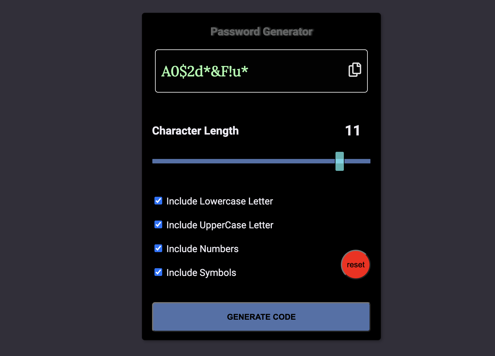

## Welcome! 👋

## Overview

Welcome to my Password Generator App built using Vanilla Javascript. I developed this app with a variety of features and options to empower users to generate powerful passwords with a seamless user experience.

## Table of contents

- [Overview](#overview)
  - [The challenge](#the-challenge)
  - [Screenshot](#screenshot)
  - [Links](#links)
  - [Built with](#built-with)
  - [What I learned](#what-i-learned)
  - [My favorite code](#my-favorite-code-from-this-challenge)
  - [Continued development](#continued-development)
  - [Useful resources](#useful-resources)
  - [Acknowledgments](#acknowledgments)
- [Author](#author)

## The challenge

My challenge was to build a password generator app with the following user capabilities:

- Generating a password based on selected inclusion options
- Copying the generated password to the clipboard and pasting it
- Resetting all settings to default (except the welcome message)
- Choosing the character length of the password
- Generating passwords that include lowercase letters, uppercase letters, numbers, and symbols if all checkboxes are checked
- Displaying a message when the settings are reset
- Displaying a "Copied!" message when the password is copied
- Showing and hiding the reset message and copy message
- Applying hover and focus states to all interactive elements on the page

### Screenshot



### Links

- Live Site URL: https://password-generator-xi-drab.vercel.app/

### Built with

- Semantic HTML5 markup
- CSS custom properties
- Flexbox
- Mobile-first workflow
- [Vanilla JavaScript](https://developer.mozilla.org/en-US/docs/Web/JavaScript)
- [Cascading Style Sheets](https://developer.mozilla.org/en-US/docs/Web/CSS) -

### What I learned

My mission was to implement a password generator with customizable options and clipboard functionality. This involved manipulating strings and generating secure passwords based on user preferences.

- I gained experience in interacting with the clipboard, allowing users to easily copy and paste generated passwords for convenience and security.
- Resetting the user interface to default settings enabled a fresh start.
- I learned how to handle user input, validate it, and provide appropriate feedback for a seamless user experience.
- Applying CSS styling and incorporating interactive states like hover and focus improved the visual appeal and interactivity of the app, enhancing user engagement.
- Throughout the project, I developed problem-solving skills, attention to detail, and a structured approach to coding, contributing to my growth as a web developer.

## My favorite code from this challenge:

I needed to display a message for a short time when the button was clicked. So I found this solution for this problem. This JavaScript code snippet adds a click event listener to an element with the ID copyBtn.

- When clicked, it sets the opacity of an element with the ID msg to 1, making it visible.
  Using setTimeout, it then sets the opacity back to 0 after a delay of 1800 milliseconds (1.8 seconds).
- Finally, the function copyToClipboard() is called, performing the action of copying something to the clipboard.

```js
copyBtn.addEventListener('click', () => {
  msg.style.opacity = '1';

  setTimeout(() => {
    msg.style.opacity = '0';
  }, 1800);
  copyToClipboard();
});
```

### Continued development

In future projects, I aim to improve in the following areas:

- Data Fetching: Enhancing data fetching techniques, working with APIs, and handling asynchronous programming.

- State Management: Improving state management in larger applications using solutions like Redux.

### Useful resources

- [Javascript ebook](https://javascript.info/) - This resource was giving me a nice and structured overview of Javascript.

- [Javascript ebook](https://eloquentjavascript.net/) - This resource was fundamental forlearning the basics.

## Author

- Website - [Murci2022/ M.K.Y.](portfolio-mate.vercel.app) -
  Personal portfolio showcasing my web development journey and projects.

## Acknowledgments

Thank you to Marijn Haverbeke and javascript.info for providing valuable resources and guidance.
