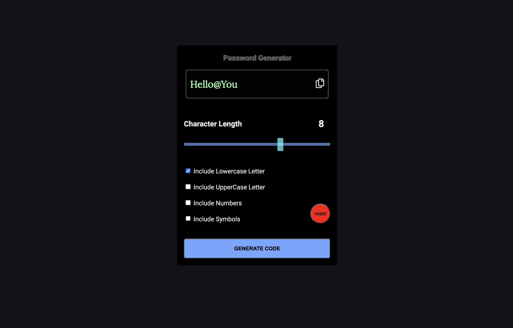

# Password generator app solution 


## Table of contents

- [Overview](#overview)
  - [The challenge](#the-challenge)
  - [Screenshot](#screenshot)
  - [Links](#links)
  - [Built with](#built-with)
  - [What I learned](#what-i-learned)
  - [Continued development](#continued-development)
  - [Useful resources](#useful-resources)
- [Author](#author)
- [Acknowledgments](#acknowledgments)


## Overview

My coding challenge was to develop a powerful Password Generator App that would empower users with a variety of features and options. I set out to create an app that would not only generate secure passwords but also provide a seamless user experience.

# Password generator app



## Welcome! 👋

## The challenge

My challenge was to build a password generator app with the following user capabilities:
- Generating a password based on selected inclusion options
- Copying the generated password to the clipboard and pasting it
- Resetting all settings to default (except the welcome message)
- Choosing the character length of the password
- Generating passwords that include lowercase letters, uppercase letters, numbers, and symbols if all checkboxes are checked
- Displaying a message when the settings are reset
- Displaying a "Copied!" message when the password is copied
- Showing and hiding the reset message and copy message
- Applying hover and focus states to all interactive elements on the page


### Screenshot


### Links

- Live Site URL: https://password-generator-xi-drab.vercel.app/


### Built with

- Semantic HTML5 markup
- CSS custom properties
- Flexbox
- Mobile-first workflow
- [Vanilla JavaScript](https://developer.mozilla.org/en-US/docs/Web/JavaScript) 
- [Cascading Style Sheets](https://developer.mozilla.org/en-US/docs/Web/CSS) - 

### What I learned

My mission was to implement a password generator with customizable options and clipboard functionality. This involved manipulating strings and generating secure passwords based on user preferences.
I gained experience in interacting with the clipboard, allowing users to easily copy and paste generated passwords for convenience and security.
Resetting the user interface to default settings enabled a fresh start, and I learned how to handle user input, validate it, and provide appropriate feedback for a seamless user experience.
Applying CSS styling and incorporating interactive states like hover and focus improved the visual appeal and interactivity of the app, enhancing user engagement.
Throughout the project, I developed problem-solving skills, attention to detail, and a structured approach to coding, contributing to my growth as a web developer.

My favorites from this challenge:

```html
        <span class="range-input-conti" id="range-input-conti">

          <input type="range" class="custom-range" id="slider" min="0" max="12" value="8" step="1">
        </span>
```
```css
.msg{
    position: absolute;
    right: 0;
    bottom: -30px;
    opacity: 0;
    transition: opacity 1s ease;
}
```
```js
copyBtn.addEventListener("click",()=>{
    msg.style.opacity = "1"

    setTimeout(()=>{
        msg.style.opacity = "0"
    },1800)
    copyToClipboard();
    

})
```


### Continued development

In future projects, I want to focus on the following areas to improve my skills:

Data Fetching: Enhancing data fetching techniques, working with APIs, and handling asynchronous programming.

State Management: Improving state management in larger applications using solutions like Redux, MobX, or Context API.

Testing and Debugging: Exploring testing methodologies and effective debugging techniques for ensuring code quality and reliability.

### Useful resources

https://eloquentjavascript.net/
- [Javascript ebook](https://eloquentjavascript.net/) - This helped me for learning the basics.

## Author

- Website - [Murci2022/ M. K. Y.](portfolio-mate.vercel.app)

## Acknowledgments

Thank you to Marijn Haverbeke:

